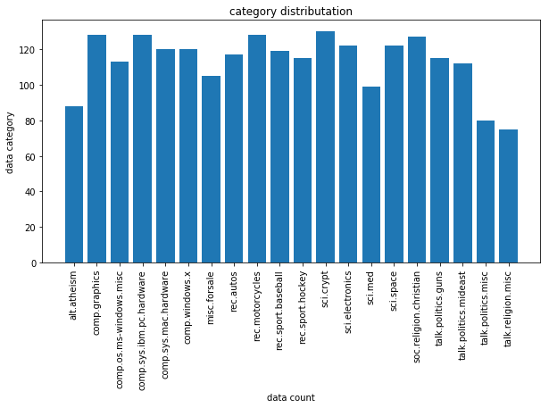
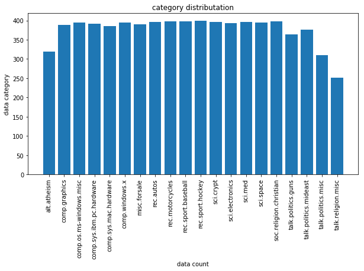
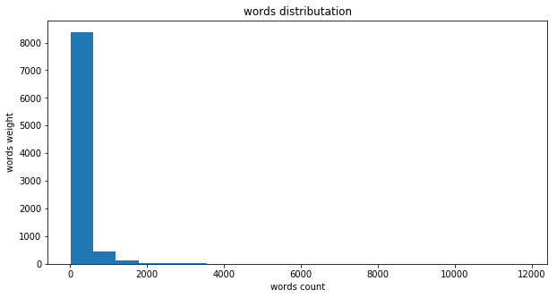

# Machine Learning Engineer Nanodegree
## Capstone Proposal
杨铁龙 

June 16th, 2018

## Proposal

### 项目背景

自然语言处理(NLP)属于人工智能的分支，作用于将自言语言转化为计算机语言进行处理，以及将计算机语言转化为自然语言进行表达[1]。自然语言在现代人工智能产品中应用广泛，尤其在智能语音方面，自然语言成为人机交互的纽带。当前自然语言处理仍面临诸多挑战，文章的表达分析是其中之一。单词边界、词义以及行为推里都是影响文章推理问题的因素，统计语言中统计概率模型，但是难以确认词与词的关联性，影响到文本分析的准确性[2]。本文将尝试Word2Vec模型分析并表示样本数据中的每篇文章，然后作为输入向量，选取机器学习模型进行训练，解决文章的表达分析问题。

### 问题描述

本文将使用20类新闻包作为样本进行训练分析，20类新闻分类是一个多分类的有监督学习问题。本文将使用BOW、TF-IDF和Word2Vec模型提取并表示样本数据中的每篇文章，需要考虑到数据的解析问题，准确把握数据的分类特征，然后利用机器学习模型决策树模型、支持矢量机(SVM)模型、朴素贝叶斯模型和神经网络模型进行训练，并选择合适的评估模型进行性能评估。从而选出合适的文本表示方式和机器学习模型，通过对比验证Word2Vec与BOW和TF-IDF是否提高了文本表示的准确性。

### 数据或输入

分类的文本数据为经典的20类新闻包[3]，包含约20000条新闻，较均衡的分成了20类，是较常用的文本分类数据之一。项目中可以通过 `sklearn.datasets.fetch_20newsgroups`方法进行引用，获取数据时通过指定 subset 为 train 或者 test 来指明数据用来训练还是测试，有效且方便训练模型并进行验证。20类新闻包中包含18846个样本数据，其中有11314个训练样本和7532个测试样本，按照交叉验证思想将训练集再拆分出20%验证集进行训练，所以最后为9051个训练集样本，2263个验证集样本和7532个测试集样本。

每个样本特征中包含作者、主题、组织和行数等头部信息，以及引用和正文信息，最后包含作者信息。标签则为对应类别的序号,如下图所示:

样本类别包含alt.atheism、comp.graphics和comp.os.ms-windows.misc等20个类别，训练集中样本分布如下：

验证集中样本分布如下：

测试集中样本分布如下：

由上图可见，每个数据集中类别分布较为均匀，alt.atheism和talk.religion.misc稍微较少。并且训练、验证和测试集中类别分布也较为相似，对训练后测试影响较小。

新闻数据长度分布如下，大部分少于15000个字符：

新闻数据词频分布如下，大部分少于2000个单词：

### 解决方法描述

本文将基于Word2Vec模型分析并表示样本数据中的每篇文章，然后作为输入向量，选取合适的分类模型对文本分类，并优化模型并分析其稳健性。分类模型主要包括决策树模型、支持矢量机(SVM)模型、朴素贝叶斯模型和神经网络模型textcnn[4]，将从这些分类模型中选取合适的模型进行训练并验证。

### 基准模型

本文将以Bag-of-words模型(BOW)和TF-IDF作为基准文本表示模型。BOW模型对于一个文本分析时，会忽略其中的语法和词序，将其分割并建立一个词集。TF-IDF会在解析出word在文档中出现的频率高低。文章[5]中基于BOW和TF-IDF对20newsgroups分析时结合SVM准确率约为87.15%和88.1%,本文将以此作为对比。

### 评估标准

本文中中选取合适的文本表示模型和机器学习分类模型进行训练，完成后分别计算各自的准确率进行性能评估，验证Word2Vec是否确实改善了本文分析推理。

$$ accuracy = \frac{TP + TN}{TP + TN + FP +FN} $$

### 项目设计

本文中将针对词、语句以及文章的表达分析问题，尝试Word2Vec模型分析并表示样本数据中的每篇文章，然后作为输入向量，选取合适的机器学习训练模型进行训练并验证测试，以BOW和TF-IDF为基准文本表示模型作为对比，分析Word2Vec模型性能表现，从而得出Word2Vec模型能否确实应对文章的表达分析问题。设计流程具体如下：

1.通过sklearn.fetch_20newsgroups获取数据，并按照交叉验证方式分割出训练集、验证集和测试集。

2.数据处理。检查数据集类别分布情况，进行平衡。去除异常样本。去除冗余字段。

3.通过gensim.models.word2vec[6]对text8[7]进行训练，得到word2vec词向量模型并提供给机器学习模型进行训练，并在之后与BOW和TF-IDF进行对比。

4.利用机器学习模型决策树模型、支持矢量机(SVM)模型、朴素贝叶斯模型和textcnn进行训练，并对训练模型通过参数优化，并进行对比分析。

5.对BOW,TF-IDF和Word2Vec在各个机器学习模型下的表现进行分析，论证Word2Vec是否提高了文本分类的准确性。

### 参考文献

[1]	 https://zh.wikipedia.org/wiki/自然语言处理

[2]	 https://github.com/nd009/capstone/tree/master/document_classification

[3]	 http://www.qwone.com/~jason/20Newsgroups/

[4] https://link.springer.com/chapter/10.1007/978-3-319-25207-0_14

[5] https://dl.acm.org/citation.cfm?id=2390688

[6] https://radimrehurek.com/gensim/models/word2vec.html

[7] http://mattmahoney.net/dc/text8.zip

