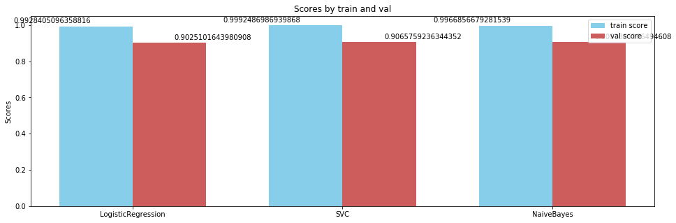
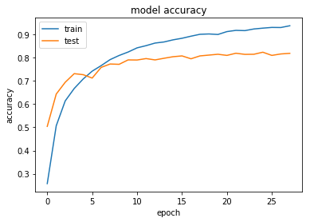
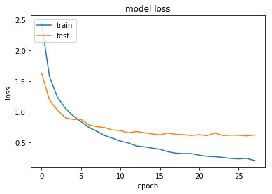

# 机器学习
杨铁龙 

2018年9月17日

##1 问题的定义

###1.1 项目概述

自然语言处理(NLP)属于人工智能的分支，作用于将自言语言转化为计算机语言进行处理，以及将计算机语言转化为自然语言进行表达[1]。自然语言在现代人工智能产品中应用广泛，尤其在智能语音方面，自然语言成为人机交互的纽带。当前自然语言处理仍面临诸多挑战，文章的表达分析是其中之一。单词边界、词义以及行为推里都是影响文章推理问题的因素，统计语言中统计概率模型，但是难以确认词与词的关联性，影响到文本分析的准确性[2]。

本文将借助20类新闻包[3]和text8[4]作为实验样本,尝试词袋模型BOW[5]和词向量模型Word2Vec[6]分析并表示样本数据中的每篇文章，然后作为输入向量，选取机器学习模型进行训练并与之前的词袋模型进行对比分析，验证词向量模型在表达分析问题上的准确性提升。

###1.2 问题描述

本文将使用20类新闻包和text8作为样本进行训练分析，这是一个多分类的有监督学习问题。

本文将使用BOW和Word2Vec模型提取并表示样本数据中的每篇文章，需要考虑到数据的解析问题，准确把握数据的分类特征，然后利用机器学习模型ogistic回归模型、支持矢量机(SVM)模型、朴素贝叶斯模型和神经网络模型进行训练，并选择准确性比较进行性能评估。

通过对比验证BOW和Word2Vec模型在表示样本数据上准确性，验证词向量模型在表达分析问题上是否使准确性提升。

###1.3 评价指标

本文中中选取合适的文本表示模型和机器学习分类模型进行训练，完成后分别计算各自的准确率进行性能评估，验证Word2Vec是否确实改善了本文分析推理。

$$ accuracy = \frac{正确样本数}{样本总数} $$

准确性可以有效的反映出BOW和Word2Vec模型在表示样本数据的性能，可以满足本文想验证词向量模型在表达分析问题上是否使准确性提升的需求。

##2 问题的定义

###2.1 数据的探索

分类的文本数据为经典的20类新闻包，包含约20000条新闻，较均衡的分成了20类，是较常用的文本分类数据之一。项目中可以通过 `sklearn.datasets.fetch_20newsgroups`方法进行引用，获取数据时通过指定 subset 为 train 或者 test 来指明数据用来训练还是测试，有效且方便训练模型并进行验证。20类新闻包中包含18846个样本数据，其中有11314个训练样本和7532个测试样本，按照交叉验证思想将训练集再拆分出20%验证集进行训练，所以最后为9051个训练集样本，2263个验证集样本和7532个测试集样本。

每个样本特征中包含作者、主题、组织和行数等头部信息，以及引用和正文信息，最后包含作者信息。标签则为对应类别的序号,如下图所示:

样本类别包含alt.atheism、comp.graphics和comp.os.ms-windows.misc等20个类别。

###2.2 探索性可视化
训练集中样本分布如下：

验证集中样本分布如下：

测试集中样本分布如下：

由上图可见，每个数据集中类别分布较为均匀，alt.atheism和talk.religion.misc稍微较少。并且训练、验证和测试集中类别分布也较为相似，对训练后测试影响较小。

新闻数据长度分布如下，大部分少于15000个字符：

新闻数据词频分布如下，大部分少于2000个单词：

###2.3 算法和技术
本文中文本表示模型中以词袋模型BOW为基准模型，并加权词频TF-IDF向量，在文本预处理中，选择出现个数大于2，频率小于0.95的词建立词袋模型。而词向量模型选择Word2Vec来表示每篇文章，Word2Vec中将借助text8训练集来建立文本表示模型。

对于在某一特定文件里的词语 ti来说, 它的TF-IDF计算公式[7]如下所示：

其中中ni,j是该词在文件 dj中的出现次数,D为训练集中的文件总数。

word2vec包含两种计算方法skip-gram和cbow[8]，Skip-Gram是给定input word来预测上下文。而CBOW是给定上下文，来预测input word。如下图所示：

本文在建立word2vec时，使用默认值0，即cbow计算方式。

机器学习模型中，由于词袋模型无法难以表达文本中词之间的关联性，适用于传统机器学习模型，但不适合text-cnn模型。而Word2Vec可以用维数较少的向量表达词以及词之间的关联性，适用于text-cnn模型，但由于维度差异的存在，不适用于机器学习模型。因此将通过ogistic回归模型、支持矢量机(SVM)模型和朴素贝叶斯模型对BOW并加权词频TF-IDF[9]向量后输出的数据进行训练。而通过text-cnn模型训练Word2Vec输出的数据。

text-cnn模型[10]是利用卷积神经网络对文本进行分类的算法, 分为嵌入层
，卷积层，池化层和全连接层，实现样本的局部特征提取，从而提高识别率，如下图所示：

###2.4 基准模型
本文将以Bag-of-words模型(BOW)作为基准文本表示模型。BOW模型对于一个文本分析时，会忽略其中的语法和词序，将其分割并建立一个词集。文章[11]中基于BOW对20newsgroups分析时结合SVM准确率约为82.1%,本文将以此作为对比。

##3 方法
###3.1 数据预处理

文章的预处理中包括:

1）去除标点符号符号，然后使用空格符分割原有文章，将文章装换成单词数组。

2）建立TF-IDF时,只使用频率低于0.97，数量高于2个的单词进行训练，过滤掉其他的。 

3）stop_words使用'english', 减少停用词带来的消极影响。

将训练集通过CountVectorizer和TfidfVectorizer建立BOW和TF-IDF词袋模型。TF-IDF加权后所建立的训练集如下图所示：

将训练集通过gensim.models建立词向量模型word2vec，并利用text8训练集进行训练。

###3.2 执行过程
执行过程中主要需要:

1）通过sklearn中LogisticRegression，SVC和MultinomialNB分别对TF-IDF建立表示的数据集进行训练，其中LogisticRegression设置"C=0"，其余为默认值，SVC设置'kernel'为'linear'，“random_state=0”，并且“gamma=0.9”，而MultinomialNB则设置alpha=0.01。训练时需要将训练集，验证集和测试集分开处理，并记录结果，如下图所示。

2）通过text_cnn对word2vec建立的数据集进行训练，首先借助于keras工具绘制text_cnn模型图，如下图所示。

text_cnn训练时选择epochs为15，batch_size为128。

训练过程中发现由于训练集较大，对SVC训练时所需时间较长，因此借助于cpu_count来进行多核运算，提高效率。

###3.3 完善
在进行对TF-IDF建立的数据集训练时，本文先借助机器学习默认参数对数据集进行训练，然后借助与GridSearchCV进行参数优化。

优化后LogisticRegression的参数设置'C'为3；SVC的参数为kernel是‘linear’，同时设置'C'为 3, 'gamma'为 0.5；MultinomialNB的参数为alpha是0.0001。

如下图所示，三个传统机器学习模型在tf-idf加权下，经过GridSearchCV优化，训练和验证准确率都得到了提高。

| 模型 | 优化前训练acc| 优化前验证acc | 优化后训练acc | 优化后验证acc |
| ------  | ------ | ------ | ------ | ------ |
| LogisticRegression | 0.9731521378853165 | 0.8939460892620416 |  0.9928405096358816 | 0.9025101643980908 |
| SVC | 0.9821014252568777 | 0.9036676977463544 | 0.9992486986939868 | 0.9065759236344352 |
| MultinomialNB | 0.9594519942547785| 0.8859920459566947 | 0.9983207266996299 | 0.8891638677744388 |

对word2vec建立的数据集进行训练时，由于batch_size调整较为困难，
text_cnn训练时将epochs设为60, batch_size为50, batch_size较小是为了快速迭代，epochs为60 是为了保证text_cnn模型能充分拟合，同时为了防止过拟合，需要为text_cnn设置earlystoping，其参数为monitor='val_acc', patience=3, mode='max'，这样可以实现出现过拟合时，提前停止。

##4 结果
###4.1 模型的评价与验证
针对TF-IDF的传统机器学习模型中，logistic回归模型、支持矢量机(SVM)模型、朴素贝叶斯模型都表现的较好，与期望相同，三个模型经过优化后，测试准确率都在0.8以上，显示了它们稳定性较好。尤其是logistic回归模型，训练时间短，但获得了准确率较高的模型。

如下图所示，针对word2vec的text_cnn模型，参考了Yoon Kim的model，并未有参数的较大改变，但是通过其训练过程发现最后的测试为0.727，并没有训练体现的好。text_cnn模型通过训练，验证和测试对比，发现较为可靠。但是准确率方面不如传统机器学习与TF-IDF组合。由于其在epochs过多情况下，会出现模型优化停止，因此加入了EarlyStopping，防止过拟合，但准确率很难通过调整提高。

###4.2 合理性分析
SVC配合TF-IDF训练的过程中所表现出的训练时间长符合其特点，并且在传统模型中最优的准确率也符合其良好的泛化能力。并且SVC可以借助于卡方检验chi2和GridSearchCV继续挖掘更有参数，优化模型。

text_cnn配合word2vec所表现出的准确率一定范围内会随着epochs增加而增加，而0.919的准确率也体现出其较好的文本识别能力，符合cnn模型在文本识别上较高的准确率。

##5 项目结论
###5.1 结果可视化

如上图所示，为优化后传统机器学习模型对TF-IDF所表示的数据训练的过程和表现。三个模型在准确率上都表现的较好，尤其logistic回归模型训练时间短，并在最终的测试中准确率为0.8410780669144982，效果最好。

如上图所示，为text_cnn对word2vec所表示的数据训练的过程和表现。可以看到模型随着epochs在训练集上准确率会越来越高，但是在15以后都是略微增长，为了防止过拟合，在28步通过EarlyStopping提前终止了训练。

| | LogisticRegression+TF-IDF|  SVC+TF-IDF| NaiveBayes+TF-IDF | text_cnn+word2vec |
| ------ |------ |------ | ------ | ------ |
| 最终测试准确率| 0.8410780669144982 | 0.8328465215082316 | 0.8096123207647371 | 0.7272968681898132 |
由上表可见，LogisticRegression+TF-IDF在准确率上表现最好，同时期训练时间也较短，效果较好，并且在训练集合测试集上都表现较好，说明较为稳定可靠。而text_cnn+word2vec没有表现传统机器学习模型组合表现的好，说明并不足以解决文章的表达问题，还需要改善。

###5.2 对项目的思考

本文针对词边界、词义以及行为推里都是影响文章推理问题的因素，统计语言中统计概率模型，和词袋模型难以确认词与词的关联性问题，提出验证word2vec能否有效解决问题。

本文首先通过建立BOW模型，并进行TF-IDF向量加权，建立训练集，然后通过传统机器学习模型logistic回归模型、支持矢量机(SVM)模型、朴素贝叶斯模型进行训练，并借助于GridSearchCV优化模型参数，最终获得较好的模型并发现SVC效果最佳。 虽然训练过程中SVC所需时间较长，但还是通过cpu_count并发运行解决。

本文通过建立word2vec模型，建立训练集，然后通过keras绘制text_cnn卷积图，通过训练并且调整epochs获得最终较优的模型，并发现其准确率较高。

论述了LogisticRegression和text_cnn分别对于TF-IDF和word2vec的合理性，并通过最终的测试对比得出text_cnn与word2vec组合在本文并没有表现的更好。

###5.3 需要作出的改进
本文中对传统机器学习模型优化时，借助于GridSearchCV，使logistic回归模型、支持矢量机(SVM)模型、朴素贝叶斯模型表现良好，但GridSearchCV中所列的参数组合有限，并不一定最优，未来可以继续对参数组合进行优化。

本文中在对别词袋模型和词向量模型时，借助了不同的机器学习模型进行验证，但其实未能规避机器学习模型带来的影响，实验结果并不一定准确。需要继续解决text_cnn容易过拟合问题，提高其测试的准确率。

##6 参考文献
[1]	 Silva, N. L. P., & Dessen, M. A. (2003). Crianças com síndrome de Down e suas interações familiares. Psicologia: reflexão e crítica, 16(3), 503-514.

[2] Filliat, D. (2007, April). A visual bag of words method for interactive qualitative localization and mapping. In Robotics and Automation, 2007 IEEE International Conference on (pp. 3921-3926). IEEE.

[3] Hyperparameter, A. Hyperopt-Sklearn.

[4] Rengasamy, V., Fu, T. Y., Lee, W. C., & Madduri, K. (2017, November). Optimizing Word2Vec Performance on Multicore Systems. In Proceedings of the Seventh Workshop on Irregular Applications: Architectures and Algorithms (p. 3). ACM.

[5] Li, T., Mei, T., Kweon, I. S., & Hua, X. S. (2011). Contextual bag-of-words for visual categorization. IEEE Transactions on Circuits and Systems for Video Technology, 21(4), 381-392.

[6] Goldberg, Y., & Levy, O. (2014). word2vec Explained: deriving Mikolov et al.'s negative-sampling word-embedding method. arXiv preprint arXiv:1402.3722.

[7] Ramos, J. (2003, December). Using tf-idf to determine word relevance in document queries. In Proceedings of the first instructional conference on machine learning (Vol. 242, pp. 133-142).

[8] 理解 Word2Vec 之 Skip-Gram 模型, 天雨粟, https://zhuanlan.zhihu.com/p/27234078

[9] Kim, Y. (2014). Convolutional neural networks for sentence classification. arXiv preprint arXiv:1408.5882.

[10] Understanding Convolutional Neural Networks for NLP, WILDML, http://www.wildml.com/2015/11/understanding-convolutional-neural-networks-for-nlp/

[1] Wang, S., & Manning, C. D. (2012, July). Baselines and bigrams: Simple, good sentiment and topic classification. In Proceedings of the 50th Annual Meeting of the Association for Computational Linguistics: Short Papers-Volume 2 (pp. 90-94). Association for Computational Linguistics.

